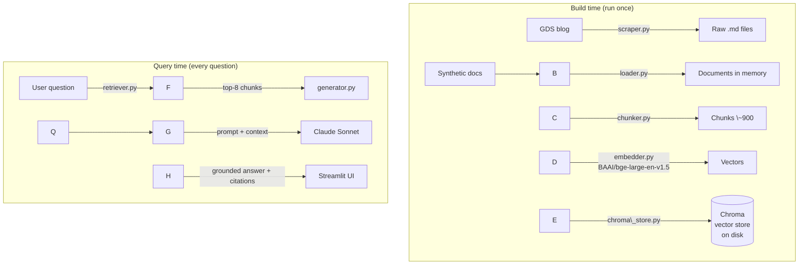

# Luminary Knowledge Assistant

A retrieval-augmented generation (RAG) assistant built over a knowledge base of consulting documents and UK Government Digital Service blog posts. Ask it a question in plain English, it finds the relevant material, and Claude answers using only what it retrieved — with citations back to the source.

This is the first project in a portfolio I'm building towards an AI Solutions Architect role. The goal wasn't to build something flashy. It was to build the whole thing end to end — ingestion, chunking, embeddings, retrieval, generation, and evaluation — and to be able to explain every decision in it, including the ones that didn't work.

!\[Python](https://img.shields.io/badge/python-3.11-blue)
!\[Claude](https://img.shields.io/badge/LLM-Claude%20Sonnet-orange)
!\[Streamlit](https://img.shields.io/badge/UI-Streamlit-red)

\---

## What It Does

The assistant sits on top of 110 documents:

* **100 posts** scraped from the [GDS blog](https://gds.blog.gov.uk) — real writing about digital transformation, GOV.UK, service design, and public-sector delivery.
* **10 synthetic documents** I generated for a fictional UK data \& AI consultancy called *Luminary Data \& AI* — discovery reports, solution proposals, project retrospectives, and case studies across retail, manufacturing, and FMCG clients.

I used synthetic consulting documents on purpose. Real client material can't go anywhere near a public repo, and inventing a consultancy let me control the corpus and write questions I knew the answers to (which matters a lot for evaluation — more on that below).

You can ask things like *"What were the main data problems at BrightMart and how were they solved?"* or *"What is a medallion architecture and why use it?"* and get a grounded answer with the source documents listed underneath.

\---

## Architecture

The pipeline splits cleanly into two phases. Everything up to the vector store is **build time** — you run it once. Everything after is **query time** — it runs on every question.



The key thing I wanted to get right architecturally was the separation of concerns. The loader, chunker, and embedder are thin helpers that each do one job and hand their output to the next step in memory. Only `chroma\_store.py` writes anything to disk. That made the whole thing much easier to reason about when retrieval quality went sideways — I could swap out one stage without touching the others.

\---

## Tech Stack

|Layer|Choice|Why|
|-|-|-|
|LLM|Claude Sonnet (Anthropic API)|Strong on grounded Q\&A, reliable at citing sources and saying "I don't know"|
|Embeddings|`BAAI/bge-large-en-v1.5`|Runs locally, no API cost, strong retrieval quality at 1024 dims|
|Vector store|Chroma|File-based, zero infrastructure, persists to disk — ideal for a local project|
|Orchestration|LangChain (core only)|Used for the Document and retriever abstractions, kept dependencies minimal|
|Chunking|RecursiveCharacterTextSplitter|Splits on natural boundaries first; honest about its limits (see below)|
|UI|Streamlit|Fastest path to a working chat interface with source display|
|Evaluation|Custom Claude-as-judge|See the evaluation section — this one has a story|

Everything runs locally and the only thing that costs money is the Claude API calls, which came to a few pounds across the entire build.

\---

## Evaluation

I didn't want this to be a project where I waved my hands and said "it seems to work." If an interviewer asks how I know the thing is any good, I want a real answer with numbers behind it.

RAG evaluation usually comes down to four metrics, and they split neatly across the two jobs the pipeline does — finding the right information, and using it to answer well:

|Metric|What it measures|Score|
|-|-|-|
|**Faithfulness**|Is the answer actually backed by the retrieved chunks, or is Claude making things up?|**0.74**|
|**Answer Relevancy**|Does the answer address the question that was asked?|**0.87**|
|**Context Precision**|Of the chunks retrieved, how many are actually relevant?|**0.27**|
|**Context Recall**|Did retrieval surface all the information needed to answer?|**0.45**|

If you've done any classification work, precision and recall here will feel familiar — precision is "of what I retrieved, how much was signal not noise", recall is "of the signal that existed, how much did I find".

### The honest read on these numbers

Answer relevancy and faithfulness are in good shape. Claude is answering the right questions and, after I tightened the system prompt, staying close to the retrieved context instead of leaning on its own training knowledge.

Precision and recall are low, and I want to be straight about why rather than dress it up. Two reasons:

**The chunking is meaning-blind.** `RecursiveCharacterTextSplitter` cuts on character count and separators — it has no idea what a chunk is *about*. So a single chunk can straddle two unrelated topics (a satisfaction score and a data-landscape heading, say), and a single fact can get split across a chunk boundary so neither half is complete on its own. Both of those hurt precision and recall directly.

**The corpus is tiny.** With only 10 synthetic documents holding the consulting facts, a lot of my eval questions depend on a specific number that lives in exactly one chunk. There's very little redundancy for the retriever to lean on. A production corpus with hundreds of documents covering the same ground from multiple angles gives retrieval far more to work with.

I went through several iterations getting here — adjusting chunk size, raising `k`, adding the BGE query prefix, filtering retrieval by source, and rewriting the prompt to stop Claude drawing on outside knowledge. The prompt rewrite was the big unlock: faithfulness jumped from 0.30 to 0.74 once I made the grounding instructions strict. Tuning the retriever moved recall but precision stayed stubborn — which is exactly what you'd expect when the bottleneck is chunking strategy, not retrieval depth.

For a first RAG build on a deliberately small corpus, I'd rather publish numbers I can explain than numbers that look good. The explanation is the point.

### What I'd do at scale

The fixes for precision and recall are well understood — I just didn't want to over-engineer a 10-document toy:

* **Semantic chunking** — split on meaning boundaries instead of character count, so a chunk holds one coherent idea and facts don't get severed mid-sentence.
* **Hierarchical (parent-document) retrieval** — index small chunks for precise matching but feed Claude the larger parent chunk for context. You get precision and completeness instead of trading one for the other.
* **A reranker** — pull a wider candidate set, then use a cross-encoder to reorder by true relevance before passing the top few to the LLM. This is usually the single biggest lever on precision.
* **A bigger, denser corpus** — more documents covering the same topics gives retrieval the redundancy it needs.

### A note on the evaluator itself

I originally built the evaluation on RAGAS, the standard library for this. It fought me hard — the version I needed had a broken internal import (`langchain\_community.chat\_models.vertexai`) that no combination of dependency pinning could resolve, and the wider LangChain ecosystem had moved several major versions past what RAGAS expected.

After enough hours lost to dependency hell, I made a call: I dropped RAGAS entirely and wrote my own evaluator. It uses Claude as the judge, with a purpose-built prompt for each of the four metrics, returning structured JSON I parse and average. It does what RAGAS does — LLM-as-judge scoring — without the dependency baggage, and as a side effect I now understand exactly what each metric is computing rather than treating it as a black box. The code is in `evaluation/ragas\_eval.py` (the filename is a leftover from the RAGAS days).

I think that was the right architectural decision, and it's the kind of make-vs-buy trade-off the job is actually about.

\---

## Running it locally

You'll need Python 3.11 and an Anthropic API key.

```bash
# clone and enter
git clone https://github.com/AlanS12/luminary-rag-assistant.git
cd luminary-rag-assistant

# virtual environment
python -m venv venv
venv\\Scripts\\activate        # Windows
# source venv/bin/activate   # Mac/Linux

# dependencies
pip install -r requirements.txt
```

Create a `.env` file in the project root with your key:

```
ANTHROPIC\_API\_KEY=your\_key\_here
```

Then build the corpus and vector store:

```bash
# scrape the GDS blog (the 10 synthetic docs are already in data/raw/synthetic/)
python src/ingestion/scraper.py

# load, chunk, embed, and persist to Chroma — this runs the whole build pipeline
python src/vectorstore/chroma\_store.py
```

Run the app:

```bash
streamlit run app/streamlit\_app.py
```

And if you want to reproduce the evaluation:

```bash
python evaluation/ragas\_eval.py
```

\---

## Project Layout

```
luminary-rag-assistant/
├── data/
│   └── raw/
│       ├── gds\_scraped/        # scraped GDS posts (gitignored)
│       └── synthetic/          # 10 Luminary documents
├── src/
│   ├── ingestion/
│   │   ├── scraper.py          # GDS blog scraper
│   │   ├── loader.py           # reads files into Document objects
│   │   └── chunker.py          # splits documents into chunks
│   ├── embeddings/
│   │   └── embedder.py         # loads the local embedding model
│   ├── vectorstore/
│   │   └── chroma\_store.py     # build pipeline + Chroma persistence
│   ├── retrieval/
│   │   └── retriever.py        # similarity search with source filtering
│   └── generation/
│       └── generator.py        # prompt assembly + Claude call
├── evaluation/
│   ├── eval\_set.json           # 20 hand-written Q\&A pairs
│   └── ragas\_eval.py           # custom Claude-as-judge evaluator
├── app/
│   └── streamlit\_app.py        # chat UI
├── requirements.txt
└── README.md
```

\---

## Limitations

Worth being upfront about what this is and isn't:

* The consulting documents are synthetic. The clients, numbers, and engagements are invented.
* Precision and recall are low for the reasons set out above — this is a baseline implementation, not a tuned production system.
* There's no authentication, rate limiting, or cost monitoring. It's a portfolio demonstrator, not a deployed product.
* The Streamlit UI is functional rather than polished.

None of that undermines the point of the project, which was to build the full pipeline myself and understand every part of it well enough to defend it.

